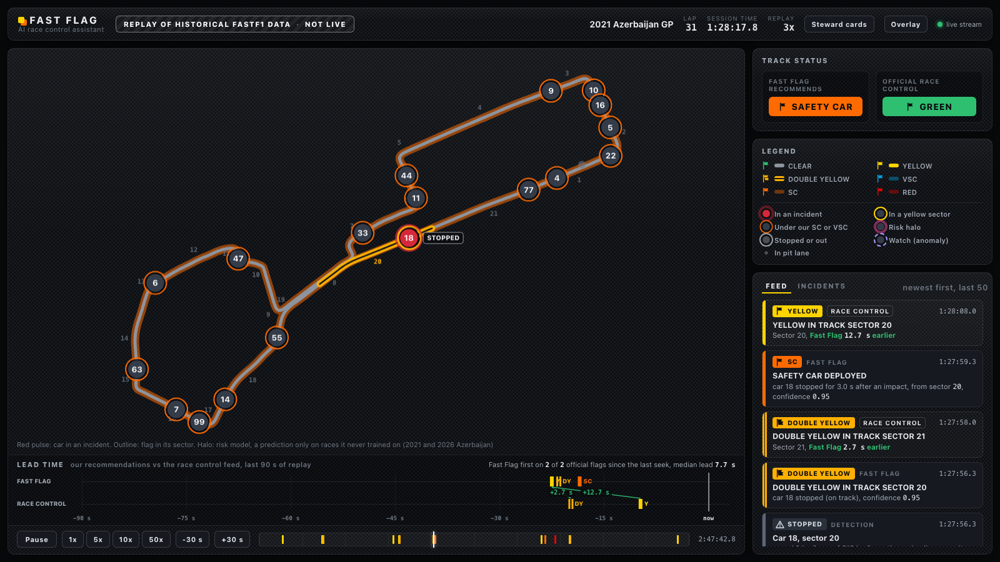
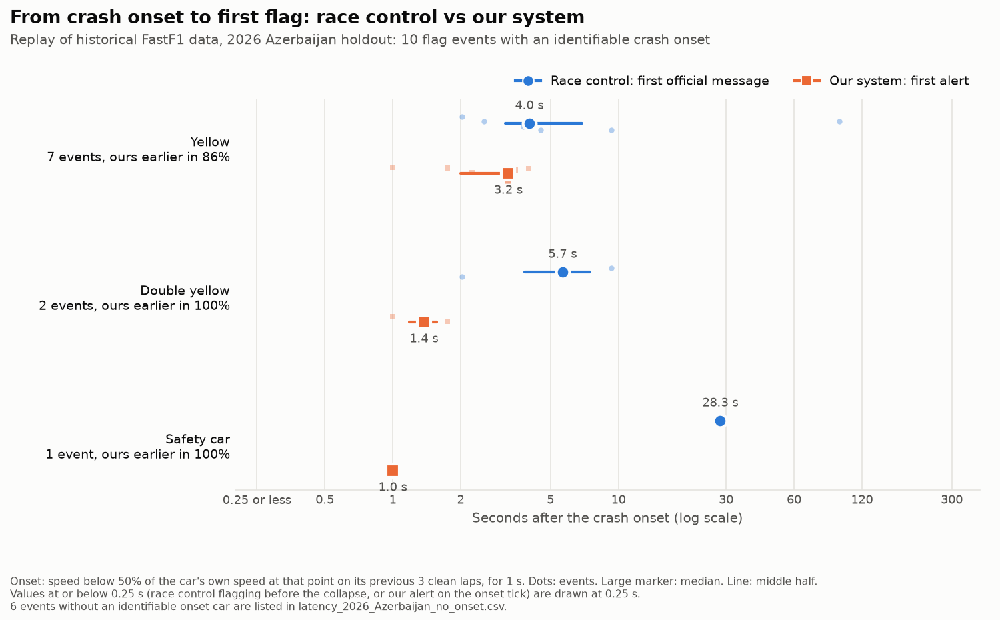
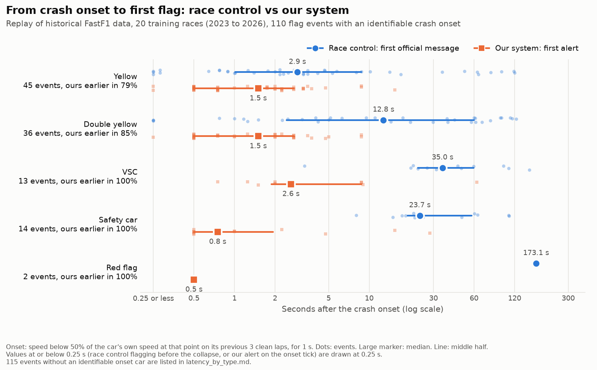
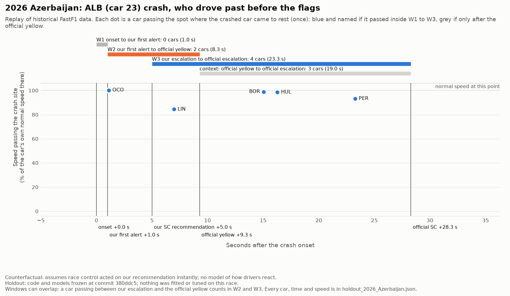
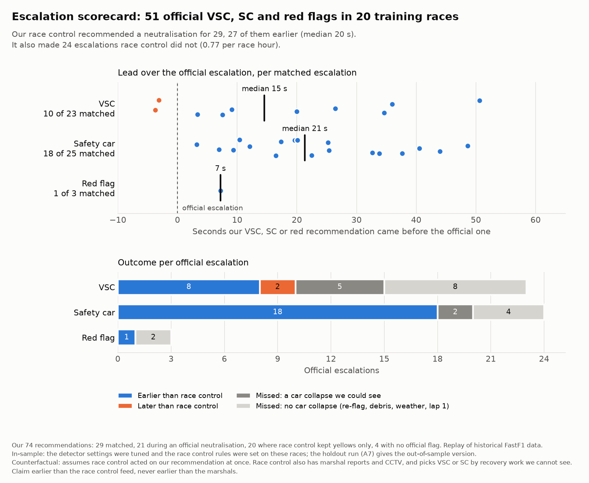
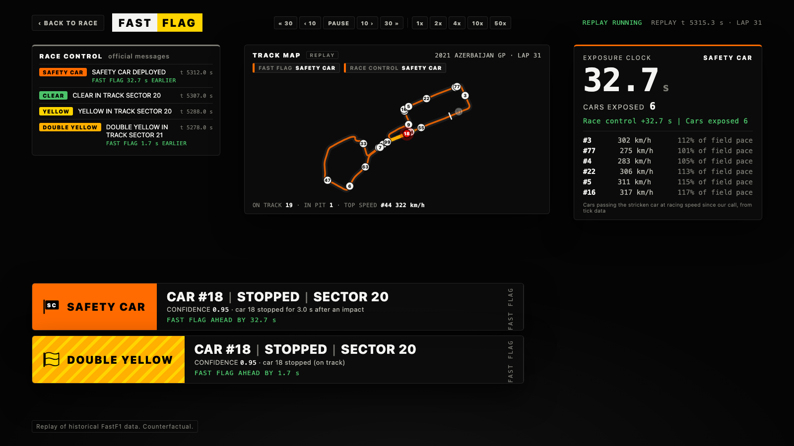
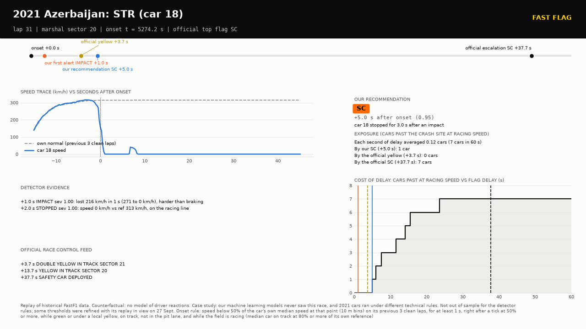
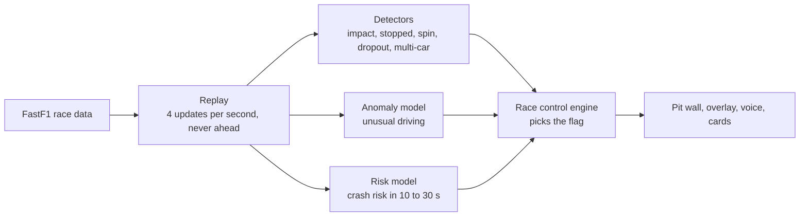

# Fast Flag

**An AI race control assistant.** It watches every car's data at once, spots a crash the moment it happens and recommends the right flag, earlier than the official race control feed.

FormulaTech Hacks 2026 · Track 1: Safety Diagnosis · Ampere: AI for motorsport safety · Team We Are So Back

> Everything shown is a **replay of historical FastF1 data**, tick by tick. No part of the system ever sees data from the future.



<sub>2021 Azerbaijan GP, lap 31. Lance Stroll's car 18 (red) has stopped on the main straight. Fast Flag already recommends the Safety Car; official race control is still green. It called the Safety Car 32.7 s later.</sub>

## Results

**Tested on a race the models never saw:** the 2026 Azerbaijan GP, run once on 26 Sept after the code was frozen.

| Time from crash to first flag (median) | Official race control | Fast Flag |
|---|---:|---:|
| Yellow flag | 4.0 s | **3.2 s** |
| Double yellow flag | 5.7 s | **1.4 s** |
| Safety Car | 28.3 s | **1.0 s** |

- **Safety Car and VSC calls:** we recommended both of race control's escalations, both earlier, with a median lead of **44 s**.
- **Few false alarms:** we caught 7 of 10 incidents at **0.6 false alarms per race hour**. A plain speed threshold needs 16.6 per hour to catch 8.
- **On 20 training races (2023 to 2026):** for the Safety Car, race control took a median 22.5 s and we took 1.0 s. For the VSC it was 35.0 s against 2.8 s. We caught 25 of the 27 VSC and Safety Car events that followed a visible crash, and were earlier in every one of them.
- **On 20 more races never used for tuning (check races, run once):** we recommended 22 of race control's 33 VSC and Safety Car calls, all 22 earlier than the race control feed, with a median lead of **32.6 s**, and made 0.76 escalations per race hour that race control never made ([`docs/charts/escalation_check.md`](docs/charts/escalation_check.md)).
- **Why seconds matter:** across 62 crashes, **every second a flag waits, about 0.12 cars drive past the crash at racing speed.**



<details>
<summary>More charts: training races, the Albon crash, the escalation scorecard</summary>




</details>

All numbers come from [`docs/charts/NUMBERS.md`](docs/charts/NUMBERS.md), which is generated from the evaluation files and never edited by hand.

## What you see

| Broadcast overlay | Steward card, one per crash |
|---|---|
|  |  |
| Our flag call, how far ahead we were, and an **Exposure Clock**: the cars that passed the wreck at racing speed while race control decided. | The crash on one slide: timeline, speed trace, evidence, our call against race control's, and the cost of each second of delay, with a plain-English explanation below. |

- **Pit wall** (`/`): the track map, cars coloured by what is happening, our flags next to race control's, the lead-time timeline and replay controls.
- **Race control voice:** reads our calls aloud like team radio, for example *"Safety Car. Car 18, stopped, sector 20"*, then *"Race control confirms Safety Car, 32.7 seconds after Fast Flag."*

## How it works



- **Two machine learning models**, trained on 20 races and tested on races they never saw:
  - an **anomaly model** (IsolationForest, learned what normal driving looks like without seeing a single crash);
  - a **risk model** (LightGBM, each car's chance of an incident in the next 10, 20 and 30 s). On the holdout race, at 10 s, it scores 13 times the chance level.
- **Rules make the final flag call**, so every recommendation comes with a reason a steward can check. For example: "car 18 stopped for 3.0 s after an impact".
- Free tools only, and no paid AI service at race time.

## Try it

```bash
python3.11 -m venv .venv && source .venv/bin/activate
pip install -r requirements.txt
python -m src.replay.server --race 2021_Azerbaijan --speed 0   # the replay server, paused
```

The server runs our whole pipeline (detectors, risk model, race control) once over the race when it starts, strictly tick by tick (about a minute the first time, then cached in `data/timeline/`), and plays it back. So you can jump anywhere in the race and see exactly what a continuous run shows at that moment. `--live` runs the pipeline as the replay plays instead; then start our race control in a second terminal with `python -m src.racecontrol`.

Open http://localhost:8000 and press **1x**. Stroll's crash is at session time 1:27:54, lap 31. Use the **Incidents** tab to jump to any flag. Other races: `GET /races`.

- **No race data?** `python -m src.replay.mock_server` plays a short built-in clip.
- **The voice, on a Mac:** `python -m src.lab.voice`.
- **Demo scripts:** [`docs/demo_pitwall.md`](docs/demo_pitwall.md) (the 2026 Azerbaijan holdout) and [`docs/lab/DEMO.md`](docs/lab/DEMO.md) (the overlay and the voice).
- **Tests:** `pytest`.

## Honest limits

- **It's a replay, not a live feed.** Post-race data is cleaner than a live timing feed.
- **We claim "earlier than the race control feed", never "earlier than the marshals".** Marshals wave local flags first, and race control also has CCTV and marshal reports that we don't.
- **It misses some, and over-calls some.** On the holdout we caught 7 of 10 incidents and recommended 2 escalations race control never made. On the training races we recommended 31 of 51 official escalations, and made 0.74 escalations per race hour that race control never made.
- **Race control rules changed after the holdout run.** On 26 and 27 Sept we changed how our race control holds and ends its flags (a crash site holds its sector until race control goes green, our flag never clears under race control's own) and when it calls a red (only late in the race). The first two were checked on replays of the 2026 Azerbaijan holdout, and the red rule was tuned on the training races with 2021 Azerbaijan as a check, so none of them has an out-of-sample test. The holdout numbers above come from the engine frozen before them.
- **Detector rules were corrected after watching the 2021 Azerbaijan replay.** On 27 Sept we fixed five bugs it showed (a car at the pit limiter counted as stopped, braking into the pit lane or behind the Safety Car counted as an impact, the lap to the grid after a red flag counted as racing, and nothing stopped detections after the chequered flag), checked on the 20 training races (false alarms 3.0 to 2.1 per race hour) and on the 20 check races (same result: 22 of 33, all earlier). So 2021 Azerbaijan is no longer out of sample for the detector rules; the machine learning models never saw it.
- **Red flags are rare and mostly invisible in car data.** Race control called 5 reds in our 20 training races. Barrier damage, gravel on the track, debris and rain don't show up in telemetry, so we only recommend a red late in a race, when a Safety Car would otherwise run to the flag: 2 of those 5 reds caught, 1 red race control never called ([`docs/lab/red_flag.md`](docs/lab/red_flag.md)). A long recovery mid-race only gets an advisory. On the 20 check races the rule did not hold up: it caught neither of race control's 2 reds (rain, and a first-lap crash) and sent 3 reds race control never called.
- **Risk is a heat indicator, not an alarm.** Some crashes have no warning signs in the data.
- **Car counts are counterfactual:** they show how cars actually drove, not how drivers would have reacted to an earlier flag.

## Project map

| Folder | What's in it |
|---|---|
| `src/ingest`, `src/replay` | FastF1 loading, features, the causal replay and its WebSocket server |
| `src/detect`, `src/predict` | the incident detectors, the anomaly model and the risk model |
| `src/racecontrol` | the flag engine |
| `src/eval`, `docs/charts` | evaluation, charts and `NUMBERS.md` |
| `dashboard`, `src/lab`, `docs/lab` | the pit wall, the overlay, the voice, the steward cards and the delay-cost analysis |

The full spec is in [`PROJECT_BRIEF.md`](PROJECT_BRIEF.md), and the team's rules and data contracts are in [`CLAUDE.md`](CLAUDE.md).
